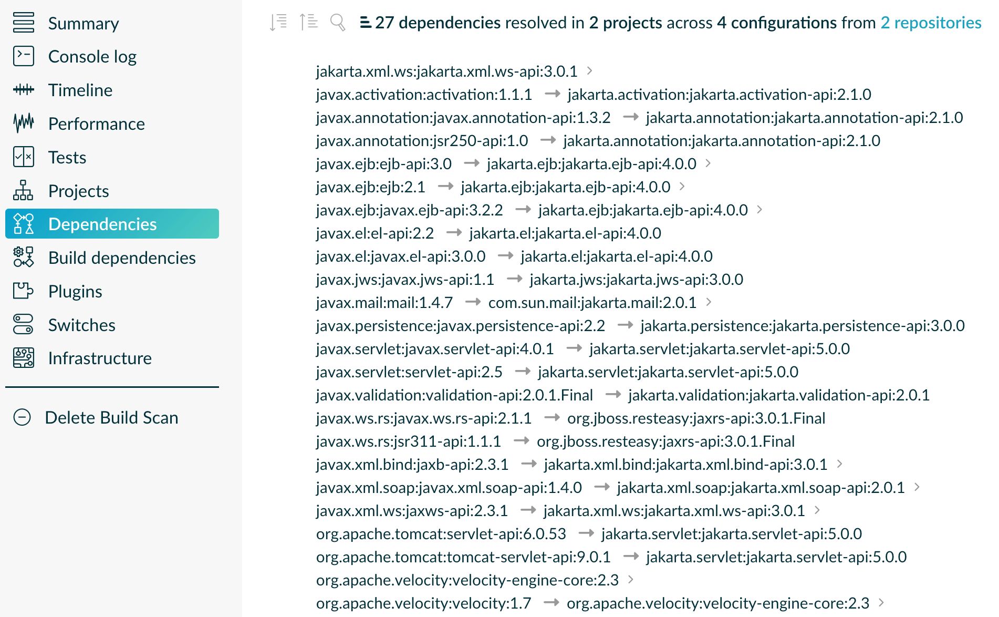

# Java Ecosystem Capabilities Gradle Plugin

This plugin adds [Capabilities](https://docs.gradle.org/current/userguide/component_capabilities.html#capabilities_as_first_level_concept) 
to the metadata of well-known components hosted on Maven Central that are used in many Java projects.

## What is a 'Capability' in Gradle and why should I care?

In [the video below](https://www.youtube.com/watch?v=5g20kbbqBFk&list=PLWQK2ZdV4Yl2k2OmC_gsjDpdIBTN0qqkE), 
I explain the concept of Capability Conflicts and why they can help you to avoid "dependency hell" in your project.
With this plugin, you enable Gradle to detect and automatically resolved typical capability conflicts in the Java Ecosystem.

[](https://www.youtube.com/watch?v=5g20kbbqBFk&list=PLWQK2ZdV4Yl2k2OmC_gsjDpdIBTN0qqkE)

## How to use the plugin?

Apply the plugin to all (sub)projects of your build so that the capability-adding rules are active everywhere.
There is nothing else you need to do. The rules will now be considered when dependencies are resolved.
For general information about how to structure Gradle builds, and apply community plugins like this one to all subprojects,
you can check out my [Understanding Gradle video series](https://www.youtube.com/watch?v=N95YI-szd78&list=PLWQK2ZdV4Yl2k2OmC_gsjDpdIBTN0qqkE).

### Plugin dependency

Add this to the build file of your convention plugin's build
(e.g. `build-logic/build.gradle(.kts)` or `buildSrc/build.gradle(.kts)`).

```
dependencies {
    implementation("de.jjohannes.gradle:java-ecosystem-capabilities:0.7")
}
```

### Apply the plugin

In your convention plugin, apply the plugin.

```
plugins {
    ...
    id("de.jjohannes.java-ecosystem-capabilities")
}
```

### Alternative: Copy rules into your build logic

Instead of applying this plugin, you may also copy selected rules to your own _build logic_ and register them in your convention plugin(s) directly.
In [the list below](#which-components-does-this-plugin-affect), all rule implementations are linked.
Here they are implemented in Java, but converting them to Kotlin or Groovy should be straightforward if you prefer.

### I use the plugin and now there is a conflict - what now?

The plugin configures Gradle to resolve conflicts by selecting the highest version.
If this is not possible, because there is no single highest version, you will get a conflict error.

If you get an error like this:

```
> Module 'com.sun.mail:jakarta.mail' has been rejected:
     Cannot select module with conflict on capability 'javax.mail:mail:2.0.1' also provided by [com.sun.mail:mailapi:2.0.1(compile)]
```

It means that you need to make a decision for the given capability - in this case `javax.mail:mail` - by selecting one of the modules that both provide the capability.
In this case, you can decide between `com.sun.mail:jakarta.mail` (see first line of message) and `com.sun.mail:mailapi` (see end of second line).

A decision is made by defining a resolution strategy for the capability.
This is best done in the place where you applied this plugin (e.g. one of your convention plugins):

```
configurations.all {
  resolutionStrategy.capabilitiesResolution {
    withCapability("javax.mail:mail") {        // Capability for which to make the decision
      select("com.sun.mail:jakarta.mail:0")    // The component to select
    }
  }
}
```

## What is the concrete effect of the plugin?

The plugin makes sure that during dependency resolution, you do not end up with two components that 'do the same thing' in the dependency resolution result.
That is, you won't have two Jars with different names (e.g. `jakarta.xml.bind-api-3.0.1.jar` and `jaxb-api-2.3.1.jar`) but same/similar classes on the classpath.
In this example, Gradle will use `jakarta.xml.bind-api` in place of `jaxb-api` in all places.
You can see all effects in [this build scan](https://scans.gradle.com/s/d45kd3g3uztlu/dependencies?toggled=W1swXSxbMCwxXV0)
from this [artificial sample project](samples/sample-all/build.gradle.kts) that includes dependencies to all components covered by rules in this plugin.


[](https://scans.gradle.com/s/d45kd3g3uztlu/dependencies?toggled=W1swXSxbMCwxXV0)

## Which Components does this plugin affect?

The following list shows all Capabilities and the Components they are added to.
Each Capability's GA coordinates correspond to the GA coordinates of the Component that first introduced the Capability.

<!-- START_GENERATED -->
* [asm:asm](https://mvnrepository.com/artifact/asm/asm) ([AsmRule](src/main/java/de/jjohannes/gradle/javaecosystem/capabilities/rules/AsmRule.java))
  * [org.ow2.asm:asm](https://mvnrepository.com/artifact/org.ow2.asm/asm)
* [c3p0:c3p0](https://mvnrepository.com/artifact/c3p0/c3p0) ([C3p0Rule](src/main/java/de/jjohannes/gradle/javaecosystem/capabilities/rules/C3p0Rule.java))
  * [com.mchange:c3p0](https://mvnrepository.com/artifact/com.mchange/c3p0)
* [cglib:cglib](https://mvnrepository.com/artifact/cglib/cglib) ([CGlibRule](src/main/java/de/jjohannes/gradle/javaecosystem/capabilities/rules/CGlibRule.java))
  * [cglib:cglib-nodep](https://mvnrepository.com/artifact/cglib/cglib-nodep)
* [com.google.collections:google-collections](https://mvnrepository.com/artifact/com.google.collections/google-collections) ([GoogleCollectionsRule](src/main/java/de/jjohannes/gradle/javaecosystem/capabilities/rules/GoogleCollectionsRule.java))
  * [com.google.guava:guava](https://mvnrepository.com/artifact/com.google.guava/guava)
* [com.google.guava:guava](https://mvnrepository.com/artifact/com.google.guava/guava) ([GuavaRule](src/main/java/de/jjohannes/gradle/javaecosystem/capabilities/rules/GuavaRule.java))
  * [com.google.guava:guava-jdk5](https://mvnrepository.com/artifact/com.google.guava/guava-jdk5)
* [com.google.guava:listenablefuture](https://mvnrepository.com/artifact/com.google.guava/listenablefuture) ([GuavaListenableFutureRule](src/main/java/de/jjohannes/gradle/javaecosystem/capabilities/rules/GuavaListenableFutureRule.java))
  * [com.google.guava:guava](https://mvnrepository.com/artifact/com.google.guava/guava)
* [com.vividsolutions:jts-core](https://mvnrepository.com/artifact/com.vividsolutions/jts-core) ([JtsCoreRule](src/main/java/de/jjohannes/gradle/javaecosystem/capabilities/rules/JtsCoreRule.java))
  * [org.locationtech.jts:jts-core](https://mvnrepository.com/artifact/org.locationtech.jts/jts-core)
* [com.vividsolutions:jts](https://mvnrepository.com/artifact/com.vividsolutions/jts) ([JtsRule](src/main/java/de/jjohannes/gradle/javaecosystem/capabilities/rules/JtsRule.java))
  * [org.locationtech.jts:jts-core](https://mvnrepository.com/artifact/org.locationtech.jts/jts-core)
* [commons-io:commons-io](https://mvnrepository.com/artifact/commons-io/commons-io) ([CommonsIoRule](src/main/java/de/jjohannes/gradle/javaecosystem/capabilities/rules/CommonsIoRule.java))
  * [org.apache.commons:commons-io](https://mvnrepository.com/artifact/org.apache.commons/commons-io)
* [dom4j:dom4j](https://mvnrepository.com/artifact/dom4j/dom4j) ([Dom4jRule](src/main/java/de/jjohannes/gradle/javaecosystem/capabilities/rules/Dom4jRule.java))
  * [org.dom4j:dom4j](https://mvnrepository.com/artifact/org.dom4j/dom4j)
* [jakarta.activation:jakarta.activation-api](https://mvnrepository.com/artifact/jakarta.activation/jakarta.activation-api) ([JakartaActivationApiRule](src/main/java/de/jjohannes/gradle/javaecosystem/capabilities/rules/JakartaActivationApiRule.java))
  * [com.sun.activation:jakarta.activation](https://mvnrepository.com/artifact/com.sun.activation/jakarta.activation)
* [jakarta.annotation:jakarta.annotation-api](https://mvnrepository.com/artifact/jakarta.annotation/jakarta.annotation-api) ([JakartaAnnotationApiRule](src/main/java/de/jjohannes/gradle/javaecosystem/capabilities/rules/JakartaAnnotationApiRule.java))
  * [org.apache.tomcat:tomcat-annotations-api](https://mvnrepository.com/artifact/org.apache.tomcat/tomcat-annotations-api)
* [jakarta.mail:jakarta.mail-api](https://mvnrepository.com/artifact/jakarta.mail/jakarta.mail-api) ([JakartaMailApiRule](src/main/java/de/jjohannes/gradle/javaecosystem/capabilities/rules/JakartaMailApiRule.java))
  * [com.sun.mail:mailapi](https://mvnrepository.com/artifact/com.sun.mail/mailapi)
  * [com.sun.mail:jakarta.mail](https://mvnrepository.com/artifact/com.sun.mail/jakarta.mail)
  * [org.eclipse.angus:jakarta.mail](https://mvnrepository.com/artifact/org.eclipse.angus/jakarta.mail)
* [jakarta.servlet:jakarta.servlet-api](https://mvnrepository.com/artifact/jakarta.servlet/jakarta.servlet-api) ([JakartaServletApiRule](src/main/java/de/jjohannes/gradle/javaecosystem/capabilities/rules/JakartaServletApiRule.java))
  * [org.apache.tomcat:tomcat-servlet-api](https://mvnrepository.com/artifact/org.apache.tomcat/tomcat-servlet-api)
* [jakarta.ws.rs:jakarta.ws.rs-api](https://mvnrepository.com/artifact/jakarta.ws.rs/jakarta.ws.rs-api) ([JakartaWsRsApiRule](src/main/java/de/jjohannes/gradle/javaecosystem/capabilities/rules/JakartaWsRsApiRule.java))
  * [org.jboss.spec.javax.ws.rs:jboss-jaxrs-api_3.0_spec](https://mvnrepository.com/artifact/org.jboss.spec.javax.ws.rs/jboss-jaxrs-api_3.0_spec)
* [javassist:javassist](https://mvnrepository.com/artifact/javassist/javassist) ([JavaAssistRule](src/main/java/de/jjohannes/gradle/javaecosystem/capabilities/rules/JavaAssistRule.java))
  * [org.javassist:javassist](https://mvnrepository.com/artifact/org.javassist/javassist)
  * [jboss:javassist](https://mvnrepository.com/artifact/jboss/javassist)
* [javax.activation:activation](https://mvnrepository.com/artifact/javax.activation/activation) ([JavaxActivationApiRule](src/main/java/de/jjohannes/gradle/javaecosystem/capabilities/rules/JavaxActivationApiRule.java))
  * [jakarta.activation:jakarta.activation-api](https://mvnrepository.com/artifact/jakarta.activation/jakarta.activation-api)
  * [com.sun.activation:javax.activation](https://mvnrepository.com/artifact/com.sun.activation/javax.activation)
  * [com.sun.activation:jakarta.activation](https://mvnrepository.com/artifact/com.sun.activation/jakarta.activation)
* [javax.annotation:jsr250-api](https://mvnrepository.com/artifact/javax.annotation/jsr250-api) ([JavaxAnnotationApiRule](src/main/java/de/jjohannes/gradle/javaecosystem/capabilities/rules/JavaxAnnotationApiRule.java))
  * [jakarta.annotation:jakarta.annotation-api](https://mvnrepository.com/artifact/jakarta.annotation/jakarta.annotation-api)
  * [javax.annotation:javax.annotation-api](https://mvnrepository.com/artifact/javax.annotation/javax.annotation-api)
  * [org.apache.tomcat:tomcat-annotations-api](https://mvnrepository.com/artifact/org.apache.tomcat/tomcat-annotations-api)
* [javax.ejb:ejb](https://mvnrepository.com/artifact/javax.ejb/ejb) ([JavaxEjbApiRule](src/main/java/de/jjohannes/gradle/javaecosystem/capabilities/rules/JavaxEjbApiRule.java))
  * [jakarta.ejb:jakarta.ejb-api](https://mvnrepository.com/artifact/jakarta.ejb/jakarta.ejb-api)
  * [javax.ejb:javax.ejb-api](https://mvnrepository.com/artifact/javax.ejb/javax.ejb-api)
  * [javax.ejb:ejb-api](https://mvnrepository.com/artifact/javax.ejb/ejb-api)
* [javax.el:el-api](https://mvnrepository.com/artifact/javax.el/el-api) ([JavaxElApiRule](src/main/java/de/jjohannes/gradle/javaecosystem/capabilities/rules/JavaxElApiRule.java))
  * [jakarta.el:jakarta.el-api](https://mvnrepository.com/artifact/jakarta.el/jakarta.el-api)
  * [javax.el:javax.el-api](https://mvnrepository.com/artifact/javax.el/javax.el-api)
* [javax.inject:javax.inject](https://mvnrepository.com/artifact/javax.inject/javax.inject) ([JavaxInjectApiRule](src/main/java/de/jjohannes/gradle/javaecosystem/capabilities/rules/JavaxInjectApiRule.java))
  * [jakarta.inject:jakarta.inject-api](https://mvnrepository.com/artifact/jakarta.inject/jakarta.inject-api)
* [javax.jws:javax.jws-api](https://mvnrepository.com/artifact/javax.jws/javax.jws-api) ([JavaxJwsApisRule](src/main/java/de/jjohannes/gradle/javaecosystem/capabilities/rules/JavaxJwsApisRule.java))
  * [jakarta.jws:jakarta.jws-api](https://mvnrepository.com/artifact/jakarta.jws/jakarta.jws-api)
* [javax.mail:mail](https://mvnrepository.com/artifact/javax.mail/mail) ([JavaxMailApiRule](src/main/java/de/jjohannes/gradle/javaecosystem/capabilities/rules/JavaxMailApiRule.java))
  * [com.sun.mail:mailapi](https://mvnrepository.com/artifact/com.sun.mail/mailapi)
  * [jakarta.mail:jakarta.mail-api](https://mvnrepository.com/artifact/jakarta.mail/jakarta.mail-api)
  * [com.sun.mail:javax.mail](https://mvnrepository.com/artifact/com.sun.mail/javax.mail)
  * [com.sun.mail:jakarta.mail](https://mvnrepository.com/artifact/com.sun.mail/jakarta.mail)
* [javax.persistence:javax.persistence-api](https://mvnrepository.com/artifact/javax.persistence/javax.persistence-api) ([JavaxPersistenceApiRule](src/main/java/de/jjohannes/gradle/javaecosystem/capabilities/rules/JavaxPersistenceApiRule.java))
  * [jakarta.persistence:jakarta.persistence-api](https://mvnrepository.com/artifact/jakarta.persistence/jakarta.persistence-api)
  * [org.hibernate.javax.persistence:hibernate-jpa-2.2-api](https://mvnrepository.com/artifact/org.hibernate.javax.persistence/hibernate-jpa-2.2-api)
  * [org.hibernate.javax.persistence:hibernate-jpa-2.1-api](https://mvnrepository.com/artifact/org.hibernate.javax.persistence/hibernate-jpa-2.1-api)
  * [org.hibernate.javax.persistence:hibernate-jpa-2.0-api](https://mvnrepository.com/artifact/org.hibernate.javax.persistence/hibernate-jpa-2.0-api)
* [javax.servlet:servlet-api](https://mvnrepository.com/artifact/javax.servlet/servlet-api) ([JavaxServletApiRule](src/main/java/de/jjohannes/gradle/javaecosystem/capabilities/rules/JavaxServletApiRule.java))
  * [javax.servlet:javax.servlet-api](https://mvnrepository.com/artifact/javax.servlet/javax.servlet-api)
  * [jakarta.servlet:jakarta.servlet-api](https://mvnrepository.com/artifact/jakarta.servlet/jakarta.servlet-api)
  * [org.apache.tomcat:servlet-api](https://mvnrepository.com/artifact/org.apache.tomcat/servlet-api)
  * [org.apache.tomcat:tomcat-servlet-api](https://mvnrepository.com/artifact/org.apache.tomcat/tomcat-servlet-api)
* [javax.validation:validation-api](https://mvnrepository.com/artifact/javax.validation/validation-api) ([JavaxValidationApiRule](src/main/java/de/jjohannes/gradle/javaecosystem/capabilities/rules/JavaxValidationApiRule.java))
  * [jakarta.validation:jakarta.validation-api](https://mvnrepository.com/artifact/jakarta.validation/jakarta.validation-api)
* [javax.ws.rs:jsr311-api](https://mvnrepository.com/artifact/javax.ws.rs/jsr311-api) ([JavaxWsRsApiRule](src/main/java/de/jjohannes/gradle/javaecosystem/capabilities/rules/JavaxWsRsApiRule.java))
  * [org.jboss.spec.javax.ws.rs:jboss-jaxrs-api_2.1_spec](https://mvnrepository.com/artifact/org.jboss.spec.javax.ws.rs/jboss-jaxrs-api_2.1_spec)
  * [org.jboss.spec.javax.ws.rs:jboss-jaxrs-api_2.0_spec](https://mvnrepository.com/artifact/org.jboss.spec.javax.ws.rs/jboss-jaxrs-api_2.0_spec)
  * [org.jboss.spec.javax.ws.rs:jboss-jaxrs-api_1.1_spec](https://mvnrepository.com/artifact/org.jboss.spec.javax.ws.rs/jboss-jaxrs-api_1.1_spec)
  * [org.jboss.resteasy:jaxrs-api](https://mvnrepository.com/artifact/org.jboss.resteasy/jaxrs-api)
  * [jakarta.ws.rs:jakarta.ws.rs-api](https://mvnrepository.com/artifact/jakarta.ws.rs/jakarta.ws.rs-api)
  * [javax.ws.rs:javax.ws.rs-api](https://mvnrepository.com/artifact/javax.ws.rs/javax.ws.rs-api)
* [javax.xml.bind:jaxb-api](https://mvnrepository.com/artifact/javax.xml.bind/jaxb-api) ([JavaxXmlBindApiRule](src/main/java/de/jjohannes/gradle/javaecosystem/capabilities/rules/JavaxXmlBindApiRule.java))
  * [jakarta.xml.bind:jakarta.xml.bind-api](https://mvnrepository.com/artifact/jakarta.xml.bind/jakarta.xml.bind-api)
* [javax.xml.soap:javax.xml.soap-api](https://mvnrepository.com/artifact/javax.xml.soap/javax.xml.soap-api) ([JavaxSoapApiRule](src/main/java/de/jjohannes/gradle/javaecosystem/capabilities/rules/JavaxSoapApiRule.java))
  * [jakarta.xml.soap:jakarta.xml.soap-api](https://mvnrepository.com/artifact/jakarta.xml.soap/jakarta.xml.soap-api)
* [javax.xml.ws:jaxws-api](https://mvnrepository.com/artifact/javax.xml.ws/jaxws-api) ([JavaxXmlWsApiRule](src/main/java/de/jjohannes/gradle/javaecosystem/capabilities/rules/JavaxXmlWsApiRule.java))
  * [jakarta.xml.ws:jakarta.xml.ws-api](https://mvnrepository.com/artifact/jakarta.xml.ws/jakarta.xml.ws-api)
* [junit:junit](https://mvnrepository.com/artifact/junit/junit) ([JunitRule](src/main/java/de/jjohannes/gradle/javaecosystem/capabilities/rules/JunitRule.java))
  * [junit:junit-dep](https://mvnrepository.com/artifact/junit/junit-dep)
* [org.hamcrest:hamcrest-core](https://mvnrepository.com/artifact/org.hamcrest/hamcrest-core) ([HamcrestCoreRule](src/main/java/de/jjohannes/gradle/javaecosystem/capabilities/rules/HamcrestCoreRule.java))
  * [org.hamcrest:hamcrest](https://mvnrepository.com/artifact/org.hamcrest/hamcrest)
* [org.hamcrest:hamcrest-library](https://mvnrepository.com/artifact/org.hamcrest/hamcrest-library) ([HamcrestLibraryRule](src/main/java/de/jjohannes/gradle/javaecosystem/capabilities/rules/HamcrestLibraryRule.java))
  * [org.hamcrest:hamcrest](https://mvnrepository.com/artifact/org.hamcrest/hamcrest)
* [postgresql:postgresql](https://mvnrepository.com/artifact/postgresql/postgresql) ([PostgresqlRule](src/main/java/de/jjohannes/gradle/javaecosystem/capabilities/rules/PostgresqlRule.java))
  * [org.postgresql:postgresql](https://mvnrepository.com/artifact/org.postgresql/postgresql)
* [stax:stax-api](https://mvnrepository.com/artifact/stax/stax-api) ([StaxApiRule](src/main/java/de/jjohannes/gradle/javaecosystem/capabilities/rules/StaxApiRule.java))
  * [org.codehaus.woodstox:stax2-api](https://mvnrepository.com/artifact/org.codehaus.woodstox/stax2-api)
  * [javax.xml.stream:stax-api](https://mvnrepository.com/artifact/javax.xml.stream/stax-api)
* [velocity:velocity](https://mvnrepository.com/artifact/velocity/velocity) ([VelocityRule](src/main/java/de/jjohannes/gradle/javaecosystem/capabilities/rules/VelocityRule.java))
  * [org.apache.velocity:velocity](https://mvnrepository.com/artifact/org.apache.velocity/velocity)
  * [org.apache.velocity:velocity-engine-core](https://mvnrepository.com/artifact/org.apache.velocity/velocity-engine-core)
* [woodstox:wstx-asl](https://mvnrepository.com/artifact/woodstox/wstx-asl) ([WoodstoxAslRule](src/main/java/de/jjohannes/gradle/javaecosystem/capabilities/rules/WoodstoxAslRule.java))
  * [org.codehaus.woodstox:wstx-asl](https://mvnrepository.com/artifact/org.codehaus.woodstox/wstx-asl)
  * [org.codehaus.woodstox:woodstox-core-asl](https://mvnrepository.com/artifact/org.codehaus.woodstox/woodstox-core-asl)
* [woodstox:wstx-lgpl](https://mvnrepository.com/artifact/woodstox/wstx-lgpl) ([WoodstoxLgplRule](src/main/java/de/jjohannes/gradle/javaecosystem/capabilities/rules/WoodstoxLgplRule.java))
  * [org.codehaus.woodstox:wstx-lgpl](https://mvnrepository.com/artifact/org.codehaus.woodstox/wstx-lgpl)
  * [org.codehaus.woodstox:woodstox-core-lgpl](https://mvnrepository.com/artifact/org.codehaus.woodstox/woodstox-core-lgpl)

<!-- END_GENERATED -->

## Something seems to be missing

This plugin collects rules that universally apply in the Java ecosystem.
That means, that the information this plugin adds would ideally be already published in the metadata of the corresponding components.
The idea is that _every_ Java project can apply this plugin to avoid certain 'dependency hell' situations.
Even if the project does not use any of the components this plugin affects directly, transitive dependency might bring in components that cause conflicts.

At the moment this plugin is only covering a fraction of the components on Maven Central that miss capability information.
If you encounter more cases, please...

### ...contribute!

If you use this plugin and think it is missing a rule for a well-known component (or that a rule is incomplete/wrong), please let us know by

- [Opening an Issue](https://github.com/jjohannes/java-ecosystem-capabilities/blob/main/issues/new)
- [Providing a PR](https://github.com/jjohannes/java-ecosystem-capabilities/pulls) - for this you should look at the [existing rules](src/main/java/de/jjohannes/gradle/javaecosystem/capabilities/rules) and follow the same patterns for new rules

Please make sure, you clearly state which **Capability** it is about and which **Components** provide the Capability.


### Special Case: Logging Libraries

This plugin does not contain rules for logging libraries, which is a specific area in which conflicts occur regularly.
There is [a separate plugin](https://github.com/ljacomet/logging-capabilities) covering this topic by adding capabilities to the components of well-known logging APIs and implementations.
Please apply that plugin in addition to this one:

```
plugins {
    ...
    id("de.jjohannes.java-ecosystem-capabilities")
    id("dev.jacomet.logging-capabilities")
}
```

## I maintain a Component on Maven Central - How can I publish Capability information myself?

It would be great to see more components publishing capability information directly.
If you wonder how you could do it, here is how:

### Publishing with Gradle

Assuming the component you are publishing is `org.ow2.asm:asm`.
You add the `asm:asm` capability as follows:

```
configurations {
    apiElements {
        outgoing {
            capability("${project.group}:${project.name}:${project.verson}") // keep default capability 'org.ow2.asm:asm'
            capability("asm:asm:${project.verson}")                          // add 'asm:asm'
        }
    }
    runtimeElements {
        outgoing {
            capability("${project.group}:${project.name}:${project.verson}") // keep default capability 'org.ow2.asm:asm'
            capability("asm:asm:${project.verson}")                          // add 'asm:asm'
        }
    }
}
```

See also: [Documentation in Gradle Manual](https://docs.gradle.org/current/userguide/component_capabilities.html#sec:declaring-additional-capabilities-for-a-local-component)

### Publishing with Maven

Assuming the component you are publishing is `org.ow2.asm:asm`.
You add the `asm:asm` capability as follows:

```
<!-- do_not_remove: published-with-gradle-metadata -->

<build>
  <plugins>
    <plugin>
      <groupId>de.jjohannes</groupId>
      <artifactId>gradle-module-metadata-maven-plugin</artifactId>
      <version>0.2.0</version>
      <executions>
        <execution>
          <goals>
            <goal>gmm</goal>
          </goals>
        </execution>
      </executions>
      <configuration>
        <capabilities>
          <capability>
            <groupId>asm</groupId>
            <artifactId>asm</artifactId>
          </capability>
        </capabilities>
      </configuration>
    </plugin>
  </plugins>
</build>

```

See also: [Documentation of `gradle-module-metadata-maven-plugin` Maven Plugin](https://github.com/jjohannes/gradle-module-metadata-maven-plugin#defining-capabilities)


